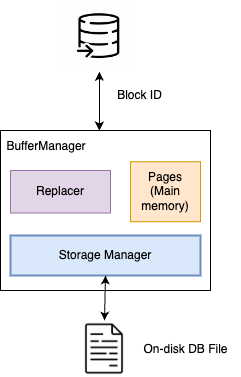
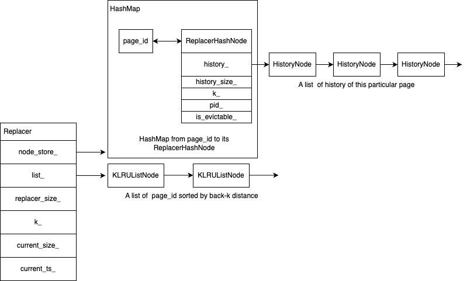
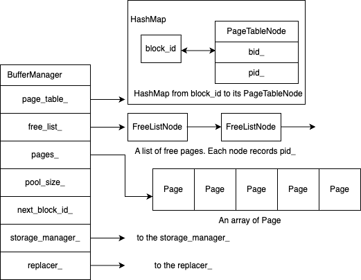

[](https://classroom.github.com/a/c-ns3yZY)
# Lab environment
The lab should be done on Mac/Linux. It also supports WSL (windows subsystem for Linux). If you use any other platforms, you can follow the steps in the [README](https://github.com/cs300-epfl/lab-setup/blob/master/vm_setup.md) to setup the VM.
All the tools required for this course are already setup inside the VM.

You can follow the steps here to setup VSCode and run the code inside the VM: [VSCode setup](https://github.com/cs300-epfl/lab-setup/blob/master/vscode_setup.md).

We use GitHub Classroom for lab submission and automatic grading and evaluation. You can check the basic information here: [Github Classroom](https://github.com/cs300-epfl/lab-setup?tab=readme-ov-file)

## Google Tests
This lab uses googletests to test your code. For ubuntu users, you can use the following command to install googletest if you have not installed it yet.
```
sudo apt install googletest libgtest-dev
```
For Mac users, you can clone the repo, compile it and install it.
```
git clone https://github.com/google/googletest
cd googletest
mkdir build
cd build
cmake ..
make
make install
```

# Lab 2
In this lab, you will build a buffer pool for the DBMS. The buffer pool allows a DBMS to support databases that are larger than the available amount of main memory. The buffer pool includes three components: a storage manager, a replacer, and a buffer manager. The storage manager is responsible for managing the disk, which is the primary storage location of the database. The buffer manager is responsible for moving the physical pages back and forth between the main memory and the disk. The replacer primarily decides which page in the main memory to move back to the disk when the main memory is full.
The buffer pool's operations are transparent to other parts of the DBMS. The DBMS asks the buffer pool to access blocks using its unique identifier `block_id`
In this lab, we will implement a single threaded buffer pool, which means we don’t need to consider race conditions and consistency across concurrent executions (thread-safety). The buffer pool we are going to implement is a much simplified version of one in a real DBMS.
Below is the organization of this lab:
```
- lab2
    - lib
        - storage_manager.c     # Code for Exercise 1
        - replacer.c            # Code for Exercise 2
        - buffer_manager.c      # Code for Exercise 3
    - inc
        - storage_manager.h     # Header file for Exercise 1
        - replacer.h            # Header file for Exercise 2
        - buffer_manager.h      # Header file for Exercise 3
        - config.h              # Header file for const
        - page.h                # Header file for page struct
        - bp_error.h            # Header file for errors
        - uthash.h              # Header file for the hash table
    - tests
        - tests-ex01            # Tests for Exercise 1
        - tests-ex02            # Tests for Exercise 2
        - tests-ex03            # Tests for Exercise 3
```
You will write the code in the `storage_manager.c`, `replacer.c` and `buffer_manager.c` files in the `lib` folder. The `inc` folder contains the header files describing the data structures you will use in your code. The `tests` folder contains the respective test cases for testing your implementation.

To run all test cases for all exercises, execute the following command:
```
make
```
You can also run tests separately by 
```
make test-ex0[1-3]
```
## Data Organization
In this lab, the storage manager manages a file on the disk. You can think of this file as an array of blocks. The filename is stored in the `filename_` field of the `StorageManager` struct. Each block in this file is `PAGE_SIZE` bytes. The blocks on the disk are indexed by `block_id` defined in `config.h`
The buffer manager, on the other side, manages a pool of physical pages in the main memory. Each physical page is `PAGE_SIZE` bytes as well. The `pages_` field in the `BufferManager` struct points to the first `Page` of the buffer pool. Each `Page` struct contains some metadata and a pointer to the data. The pointer to the data points to an array of `PAGE_SIZE` bytes. The buffer manager temporarily stores the content of a block from the disk to this array. 

The architecture of the `BufferManager` is listed as follows:



## Exercise 1: Storage Manager
In this exercise, you will implement the basic functionality of the storage manager to read and write a block from the disk. You will implement the following functions declared in `inc/storage_manager.h` and defined in `src/storage_manager.c`
- `WritePage(block_id id, const char* page_data, StorageManager *storage_manager)`: Write the data pointed by `page_data` to the `id` th block of the file managed by the `storage_manager`. You can safely assume `page_data` points to an array of bytes which is at least `PAGE_SIZE`. You can also assume the file managed by the `storage_manager` has already been opened. There are several cases where you need to return an error:
  - `-ESTORAGE_MANAGER` : `storage_manager` is `NULL`
  - `-ESTORAGE_WRITE`: `id` is negative or `page_data` is `NULL`. If seeking a block or writing to a block returns any error, also return `-ESTORAGE_WRITE`
- `ReadPage(block_id id, const char* page_data, StorageManager *storage_manager)`: Read the data from the `id` th block of file managed by the `storage_manager` and store the data in `page_data`. You can safely assume `page_data` points to an array of bytes which is at least `PAGE_SIZE`. You can also assume the file managed by `storage_manager` has already been opened. If the file ends before reading `PAGE_SIZE` bytes, fill in the rest of the `page_data` array with 0. There are several cases where you need to return error:
  - `-ESTORAGE_MANAGER` : `storage_manager` is `NULL`
  - `-ESTORAGE_READ` : `id` is negative or `page_data` is `NULL`. If the offset of the `id` th block from the beginning of the `file` is larger than the file size, return `-ESTORAGE_READ`. If seeking the block or reading from this block returns any error, also return `-ESTORAGE_READ`

The explanation of the `StorageManager` struct:
```c
typedef struct StorageManager_t{
    char *filename_;  /* The name of the open DB file */
    FILE *file_ptr_;  /* Pointer to the open file */
} StorageManager;
```
In this exercise, you may find the following functions from libc (the standard C library) helpful:
```c
/*
 * The fseek() function sets the file position indicator for the
 * stream pointed to by stream.  The new position, measured in
 * bytes, is obtained by adding offset bytes to the position
 * specified by whence.  If whence is set to SEEK_SET, SEEK_CUR, or
 * SEEK_END, the offset is relative to the start of the file, the
 * current position indicator, or end-of-file, respectively. 
 * See more: man fseek
 */
int fseek(FILE *stream, long offset, int whence);


/*
 * The ftell() function obtains the current value of the file
 * position indicator for the stream pointed to by stream.
 */
long ftell(FILE *stream);

/*
 * The function fread() reads nmemb items of data, each size bytes
 * long, from the stream pointed to by stream, storing them at the
 * location given by ptr.
 * See more: man fread
 */
size_t fread(void ptr, size_t size, size_t nmemb, FILE *restrict stream);

/* 
 * The function fwrite() writes nmemb items of data, each size bytes
 * long, to the stream pointed to by stream, obtaining them from the
 * location given by ptr.
 * See more: man fwrite
 */
size_t fwrite(const void ptr, size_t size, size_t nmemb, FILE *restrict stream);
```
## Exercise 2: Replacer
### Background of LRU-K Algorithm
In this exercise, you will implement the LRU-K algorithm as the replacement policy of our buffer pool. The LRU-K algorithm chooses a page whose backward K-distance is the maximum of all pages in the buffer pool in eviction. Backward K-distance of a page is the difference between the current timestamp and the timestamp of Kth previous access. For example, suppose the current timestamp is 10, the first previous access to the page happened at 8, the second previous access happened at 6, the backward 1-distance is thus 2 and the backward 2-distance is 4. If `K=1`, the LRU-1 algorithm is the common LRU algorithm that was taught in the lecture. A page with less than k historical accesses is given +inf (in this lab inf = `INT_FAST32_MAX`) as the backward k-distance. If there are multiple pages whose backward K-distance is +inf, the LRU-K algorithm evicts the page with the earliest access timestamp (i.e., the page whose least-recent recorded access is the overall least recent access out of all pages). For example, assume `k=2` and the current timestamp is 5, page A was only accessed at `timestamp = 2` and page B was only accessed at `timestamp = 5`. Both A and B have +inf backward K-distance. At this moment, the algorithm will evict page A because it has the earliest access timestamp. Note that there cannot be two pages whose backward K-distances are the same but less than +inf because the replacer atomically increases the current timestamp in each access to a page. 

### Implementation of the replacer
The maximum size of the LRU replacer you are going to implement will be the same as the buffer pool size since it contains metadata for all possible pages in the buffer pool. However, at any time, not all the pages in the buffer pool are evictable. The size of the LRU replacer is defined as **the number of evictable pages**. The replacer is initialized to contain no pages (thus no evictable pages) so its initial size is 0. Only when a page is added to the replacer and marked as evictable will the replacer's size increase. If a page is switched from evictable to inevictable or vice versa, the size of the replacer should change accordingly.
You will implement the following functions declared in `inc/replacer.h` and defined in `src/replacer.c`
- `ReplacerSize(Replacer *r)`: This function returns the size of the replacer which is equivalent to the number of evictable pages.
- `SetEvictable(page_id id, bool set_evictable, Replacer *r)` : This function controls whether a page is evictable or not. The size of the replacer should change accordingly. You'll know when to call this function when you implement the buffer manager in the next exercise. To be specific, when the `pin count` of a block reaches 0, its corresponding page is marked evictable and the replacer's size is incremented. If the `page` specified by `id` is not found, return directly.
- `Evict(page_id *id, Replacer *r)`: Evict the page with the largest backward k-distance compared to all other evictable pages being tracked by the replacer. Store the page id in the output parameter and return `True`. If there are no evictable pages or `r` is a NULL pointer, return False. Here if a page is selected as the eviction candidate by this function successfully, you should remove it from all the (history related) data structures of the replacer which contains this page and free the memory as well. 
- `RecordAccess(page_id id, Replacer *r)`: Record that the page with the given page_id is accessed at the current timestamp and atomically increment the current timestamp. Note that there can be two cases. The first is that the page is already tracked by the replacer where you only need to update the history and recalculate the backward K-Distance. The second is that the page is not tracked by the replacer. In this case, you have to add this page to the replacer to be tracked. By default, set the evictable flag to be true for each access. Note that the size of the replacer is always less than or equal to the maximum pages stored in the buffer pool so we don't need to consider the size overflow of the replacer. 
- `Remove(page_id id, Replacer *r)`: Clear all access history associated with this page from the replacer directly. This function should also decrement the size of the replacer if removal is successful. If the `page` specified by `id` is not found or inevictable, directly return from this function.

### The explanation of the Replacer struct
Here is the illustration and the explanation of the `Replacer` struct



The explanation of the `Replacer` struct:
```c
/* The Replacer */
typedef struct Replacer_t{
    ReplacerHashNode *node_store_; /* The pointer to the uthash hash table which maps the page_id to a ReplacerHashNode */
    KLRUListNode *list_; /* A list of page_id sorted by back-k distance */
    size_t replacer_size_; /* Maximum number of pages the replacer can track */
    size_t k_; /* LRU-K algorithm used by the replacer */
    size_t current_size_; /* The current size of the replacer. How many evictable pages the replacer is tracking */
    size_t current_ts_; /* The current timestamp. Atomically incremented in each access */
}Replacer;

/* HashNode in the node_store_ */
typedef struct ReplacerHashNode_t{
    page_id id_; /* The id of the page */
    ReplacerNode lru_node_; /* The tracking information of this page */
    UT_hash_handle hh; /* Handler for uthash hash table */
}ReplacerHashNode;

typedef struct ReplacerNode_t{
    bool is_evictable_; /* Whether the page is evictable */
    page_id pid_; /* The id of the page */
    size_t k_; /* The Back-K distance used by the replacer */
    size_t history_size_; /* The size of the access history for this page */
    struct HistoryNode_t *history_; /* A list of access histories for this page. Newer at header and older at tail */
}ReplacerNode;

typedef struct HistoryNode_t{
    size_t ts_; /* The accessed timestamp */
    struct HistoryNode_t *next_; /* The pointer to the next history (older) */
}HistoryNode;


/* A node in the list_ of the Replacer. List sorted by back-k distance */
typedef struct KLRUListNode_t{
    page_id id_; /* The id of the page */
    struct KLRUListNode_t *next_; /* The pointer to the next node in the list_ (smaller Back-K distance) */
}KLRUListNode;
```
In this exercise, you can use uthash (a hash table library) for operating the `node_store_` of the `Replacer`. You can also choose to maintain your own version by utilizing some field in the `UT_hash_handle`. You can find the explanation of uthash in the appendix. Here are some examples:
```c
/* Find a node whose id_ is id from the r->node_store_ */
page_id pid = id;
ReplacerHashNode *hash_node = NULL;
HASH_FIND_INT(r->node_store_, &pid, hash_node); /* hash_node != NULL if FOUND */

/* Add a hash_node to the r-> node_store_ */
ReplacerHashNode *hash_node = xxx;
HASH_ADD_INT(r->node_store_, id_, hash_node); /* Add hash_node using id_ field */

/* Delete a hash_node from r-> node_store */
ReplacerHashNode *hash_node = xxx;
HASH_DEL(r->node_store_, hash_node); /* Delete if hash_node exists in the node_store_ */
```


## Exercise 3: Buffer Manager
In this exercise, you will implement the buffer manager which is responsible for fetching blocks via the storage manager and storing them in the main memory pages. The buffer manager can write dirty pages out to the storage either when being asked explicitly or when it needs to evict a page to make space for a new page.
The buffer manager contains an array of `Page` structs. These `Page` structs represent all the in-memory pages in the buffer pool, each containing metadata and a pointer to the actual data. It is important to understand that `Page` structs are just containers for memory in the buffer pool and, thus, are not specific to a unique page. That is, each `Page` struct contains a block of memory (of size PAGE_SIZE bytes) that the storage manager will use as a location to copy the contents of a block that it reads from the file on the disk. The buffer manager will reuse the same `Page` struct to store data as it moves back and forth to disk. This means that the same `Page` struct may contain a different physical page throughout the lifetime of the system. The `block_id_` of the `Page` struct keeps track of which on disk block it contains; if a `Page` struct does not contain a block, then its `block_id_` must be set to `INVALID_BLOCK_ID`. The `pin_count_` of the `Page` struct records whether this `Page` is pinned in the main memory or not. The buffer manager is not allowed to free a `Page` if it is pinned. Each `Page` struct also keeps track of whether it is dirty or not. It is your job to record whether a page was modified before it is unpinned. The buffer manager must write the contents of a dirty `Page` back to disk before that `Page` struct can be reused.
The buffer manager will use the replacer you have implemented in exercise 2. The replacer will keep track of when a `Page` is accessed so that it can decide which one to evict when it must free a page to make room for copying a new physical block from disk.
You will implement the following functions declared in the header file `inc/buffer_manager.h` and defined in `src/buffer_manager.c`:
- `block_id AllocateBlock(BufferManager *bm)`: Allocate a unique new block id in the storage manager managed in the buffer manager.
- `Page* NewPage(block_id *id, BufferManager *bm)`: Allocate a new block in the storage manager by calling `AllocateBlock` and create a new page in the buffer pool which is linked to this block. Set `id` to the new block's `id`, or nullptr if all pages are currently in use and not evictable (in another word, pinned). You should pick the replacement page from either the free list or the replacer (always check the free list first), and then call the `AllocateBlock()` function to get a new block id. If the replacement page is dirty, you should write it back to its block on disk. You also need to reset the memory and metadata for the new page. You should pin the new `Page` and record the access to this new `Page` for the replacer to work correctly.
- `bool UnpinPage(block_id id, bool is_dirty, BufferManager *bm)`: Unpin the target `Page` linked with `block_id id` from the buffer pool. If `id` is not in the buffer pool or it is already unpinned, return false. Decrement the pin count of a page. If the pin count reaches 0, the page should be set evictable by the replacer. Also, set the dirty flag on the `Page` if `is_dirty` is set. If `is_dirty` is unset, keep the original dirty flag.
- `bool FlushPage(block_id id, BufferManager *bm)`: Write the `Page` containing this `id`th block back to disk. Return false if the `Page` cannot be found in the buffer manager.
- `bool DeletePage(block_id id, BufferManager *bm)`: Delete the `Page` containing the `id`th block from the buffer pool. If the `id`th block is not stored in the buffer pool, do nothing and return true. If the page is pinned and cannot be deleted, return false immediately. After deleting the page from the page table, stop tracking the page in the replacer and add it back to the free list. Also, reset the page's memory and metadata. Return true if the deletion is successful.
- `Page* FetchPage(block_id id, BufferManager *bm)`: Fetch the requested block with `id` from the storage manager and store it in a `Page` in the buffer pool. Return the pointer to the `Page` struct where the block is stored. Return nullptr if `id` has to be fetched from the storage manager but all `Page` in the buffer pool are currently in use and not evictable (pinned).  First search for `id` in the buffer pool. If found, pin this page, record the access to this page and set it inevictable. If not found, pick a replacement page from either the free list or the replacer (always find from the free list first), read the block from the storage manager and replace the old page. If the old page is dirty, you need to write it back to disk and update the metadata of the new page. 

### The explanation of the BufferManager struct



The explanation of the `BufferManager` struct:
```c
/* The buffer manager */
typedef struct BufferManager_t{
    block_id next_block_id_; /* The next unique block id used by AllocateBlock */
    size_t pool_size_; /* The size of the buffer pool. The maximum number of pages */
    Page *pages_; /* An array of the Page struct */
    FreeListNode *free_list_; /* A list of free page page_id */
    StorageManager *storage_manager_; /* Pointer to the storage manager */
    Replacer *replacer_; /* Pointer to the replacer */
    struct PageTableNode_t *page_table_; /* The pointer to the uthash hash table which maps the block_id to a page_id */
}BufferManager;

typedef struct Page_t{
    char* data_; /* The pointer to the buffered data. Must be PAGE_SIZE of bytes */
    block_id block_id_; /* The id of the block which this page buffers */
    int pin_count_; /* Whether this page is pinned or not */
    bool is_dirty_; /* Whether this page dirty or not */
} Page;

typedef struct FreeListNode_t{
  page_id page_id_; /* The page_id of the free page */
  struct FreeListNode_t* next_; /* The pointer to the next free page */
}FreeListNode;

typedef struct PageTableNode_t {
  block_id bid_; /* The block_id */
  page_id pid_; /* The page_id of the page which buffers this block */
  UT_hash_handle hh; /* Handler for uthash hash table */
}PageTableNode;
```
In this exercise, you can use uthash for operating the `page_table_` of the `BufferManager`. You can also choose to maintain your own version by utilizing some field in the `UT_hash_handle`. You can find the explanation of uthash in the appendix. Here are some examples:

```c
/* Find a node whose id_ is id from the bm->page_table_ */
block_id bid = id;
PageTableNode *pt_node = NULL;
HASH_FIND_INT(bm->page_table_, &bid, pt_node); /* pt_node != NULL if FOUND */

/* Add a pt_node to the bm->page_table_ */
PageTableNode *pt_node = xxx;
HASH_ADD_INT(bm->page_table_, bid_, pt_node); /* Add pt_node using bid_ field */

/* Delete a pt_node from bm->page_table_ */
PageTableNode *pt_node = xxx;
HASH_DEL(bm->page_table_, pt_node); /* Delete if pt_node exists in the page_table_ */
```
## Submit
You must submit (commit) your code for lab2 before Sunday, 28th of April 2024, 23:59.

You can find the steps to submit your lab [here](https://github.com/cs300-epfl/lab-setup?tab=readme-ov-file). After the submission, your results will be available online on the PR.

We recommend you pass the local test before submitting because GitHub limits the length of the error messages, so you may not see all the errors if there are too many.
## Appendix
### Platform support
This lab should be done on Linux, MacOS or WSL (windows subsystem for Linux)

### uthash
Any C structure can be stored in a hash table using uthash. Just add a `UT_hash_handle` to the structure and choose one or more fields in your structure to act as the key. Then use these macros to store, retrieve or delete items from the hash table.
Example 1. Adding an item to a hash:
```c
#include "uthash.h"

struct my_struct {
    int id;            /* we'll use this field as the key */
    char name[10];
    UT_hash_handle hh; /* makes this structure hashable */
};

struct my_struct *users = NULL;

void add_user(struct my_struct *s) {
    HASH_ADD_INT( users, id, s );
}
```

Example 2: Looking up an item in a hash:
```c
struct my_struct *find_user(int user_id) {
    struct my_struct *s;

    HASH_FIND_INT( users, &user_id, s );
    return s;
}
```

Example 3: Deleting an item from a hash:
```c
void delete_user(struct my_struct *user) {
    HASH_DEL( users, user);
}
```
For more, please refer to [uthash](https://troydhanson.github.io/uthash/)


### timeout
For macOS users, use
```
brew install coreutils
```
To install timeout

### Address sanitizer
When we compile your code, we add `-fsanitize=address` flags which enables the address sanitizer to check whether your code contains any invalid memory accesses. Whenever you code triggers an invalid memory access, the sanitizer will report the backtrace of where the invalid access is from.


For example, the following message informs you that your code reads an unknown address and triggers a segfault from `lib/buffer_manager.c:156`
